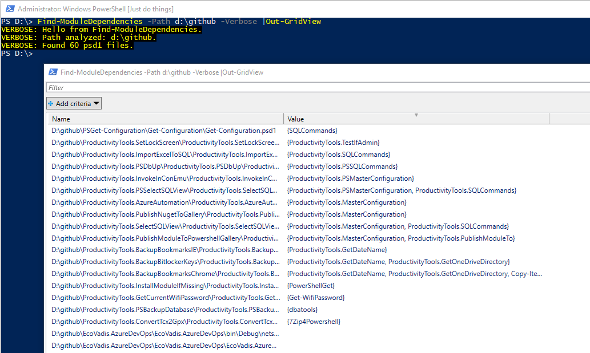
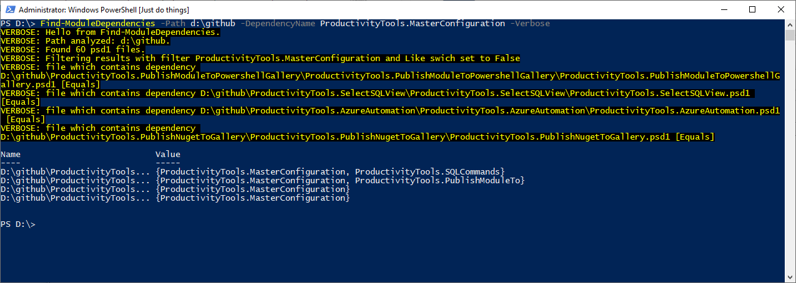
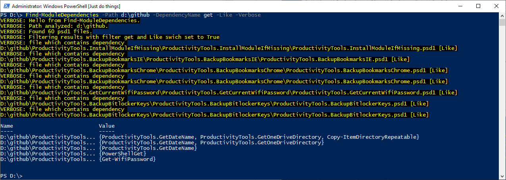
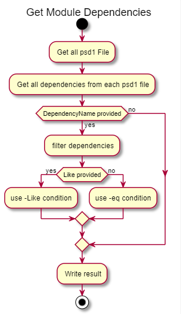

<!--Category:PowerShell--> 
 <p align="right">
    <a href="https://www.powershellgallery.com/packages/ProductivityTools.FindModuleDependencies/"></a>
    <a href="http://productivitytools.tech/find-module-dependencies/"><a> 
    <a href="https://github.com/pwujczyk/ProductivityTools.FindModuleDependencies/"></a>
</p>
<p align="center">
    <a href="http://http://productivitytools.tech/">
        
    </a>
</p>

# Find Module Dependencies

It finds all modules which are dependent on given module. 

<!--more-->

It looks recursively in the directory to find all psd1 files, next it takes the RequiredModules key and writes it. If the DependencyName parameter is provided. It will write only those modules which require a given dependency to work.


Find-ModuleDependencies without any parameters will go through all directories in the given path and will search for psd1 files, next it will write on the screen value of the RequiredModules key.

```PowerShell
Find-ModuleDependencies -Path d:\github |Out-GridView
``` 
<!--og-image-->


If you want to look for a particular dependency just use the parameter DependencyName then it will show just those modules which need provided dependency

```PowerShell
Find-ModuleDependencies -Path d:\github -DependencyName ProductivityTools.MasterConfiguration -Verbose 
```




You can also use **Like** switch parameter if you are not sure how the dependency is named.

```PowerShell
Find-ModuleDependencies -Path d:\github -DependencyName get -Like -Verbose
```



When using **like** switch module automatically adds * to the query.
```PowerShell
if ($dependency -like "*$filter*") {
    ...
```

The below diagram shows on a high level how the module works.

